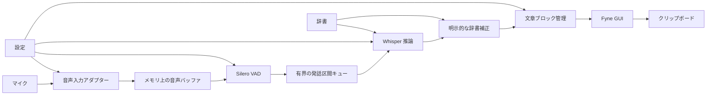

# アーキテクチャ概要

## 方針

`bosoboso`は、一つのプロセス内で音声取得、発話検出、文字起こし、辞書補正、GUI表示を行う。実行時に別プロセス、クラウド API、データベース、外部ランタイムを必要としない。

利用者が別途用意するものは、Whisper モデル、設定ファイル、辞書ファイルだけである。Silero VAD モデルはアプリへ同梱する。

## コンポーネント

## 責務の境界

| 領域 | 責務 | 外部技術 |
| --- | --- | --- |
| GUI | 状態表示、ユーザー操作、編集、コピー | Fyne |
| アプリケーション状態 | 状態遷移、ブロック管理、消去世代、再読み込み調停 | Go |
| 音声入力 | デバイス列挙、選択、PCM 取得、切断検知 | `malgo` / Core Audio |
| VAD | 発話と無音の判定、区間の生成 | `whisper.cpp` / Silero VAD |
| 音声認識 | 暫定・確定推論、文脈、Metal 利用 | `whisper.cpp`公式 Go バインディング |
| 辞書 | TOML 検証、認識誘導、明示的置換 | Go |
| 設定 | TOML の厳密な読み込み、相対パス解決 | Go |

GUIは音声入力やWhisperを直接呼び出さない。外部システムとの境界にだけ小さなインターフェースを置き、テストでは偽物または音声ファイル入力へ差し替える。

## データのライフサイクル

- 音声サンプル、処理待ち区間、暫定結果、確定結果、編集内容、確定時刻はメモリ上だけに保持する。
- 音声は推論完了後に解放する。
- 表示ブロックは設定された保持上限を超えた時点で古いものから解放する。
- 「すべて消去」では世代を更新し、操作前に投入された非同期処理結果を表示へ反映しない。
- アプリ終了時には未処理音声と表示内容を待たずに破棄する。
- ログへ音声または文字起こし内容を含めない。

## 並行処理

- 音声コールバックでは重い処理を行わず、PCM データを有界バッファへ渡す。
- VADとWhisper推論はGUIスレッドから分離する。
- GUI状態の更新はFyneが要求するスレッド境界を守る。
- 処理待ちには必ず上限を設け、上限超過を画面へ通知する。
- 辞書再読み込み、消去、終了には世代またはキャンセル可能なコンテキストを用い、古い非同期結果の反映を防ぐ。

## プラットフォーム境界

- MVPの動作保証対象はApple SiliconとmacOS 14以降とする。
- GUI、音声入力、常に手前への表示、マイク権限などのプラットフォーム依存処理を、ドメインロジックから分離する。
- 将来のIntel Mac、Windows、Linux対応を妨げないが、MVPでは動作保証しない。

## 識別情報

- アプリ名、実行ファイル名、設定ディレクトリ名はすべて`bosoboso`とする。
- Bundle IDは`io.github.take-takashi.bosoboso`とする。
- 初回MVPバージョンは`0.1.0`とし、Semantic Versioningで管理する。
